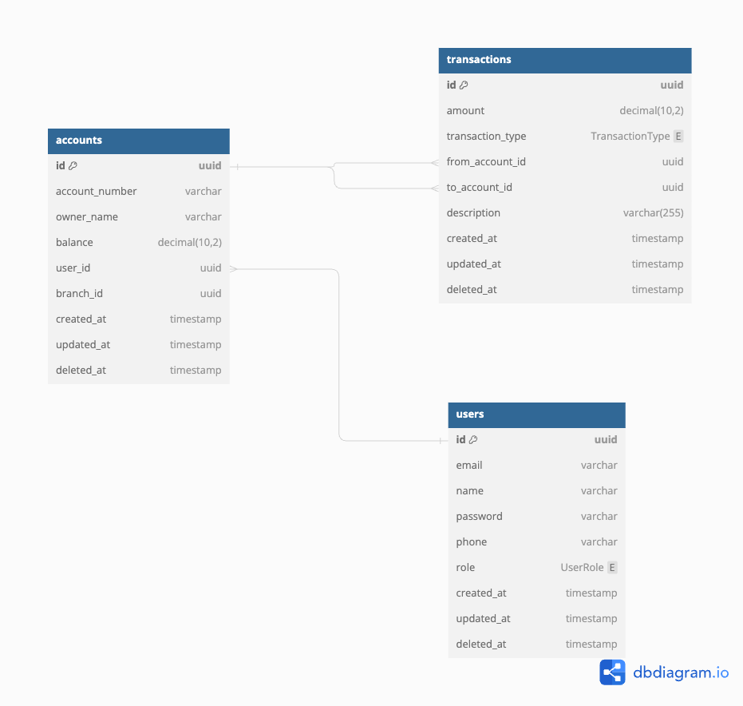

# BANK-NEST-SERVER

This project is a portfolio showcasing the implementation of Event-Driven Architecture (EDA) and Command Query Responsibility Segregation (CQRS) patterns within a Nest.js backend system. The goal of this portfolio is to demonstrate the scalability, flexibility, and efficiency of using EDA and CQRS in modern web applications.

## Overview

The portfolio project is structured around a core backend system built with Nest.js, a progressive Node.js framework for building efficient, reliable, and scalable server-side applications. By leveraging the EDA and CQRS patterns, the project aims to separate the read and write operations, ensuring high performance and maintainability, while also efficiently handling real-time data updates through events.

## Description

[Nest](https://github.com/nestjs/nest) framework TypeScript starter repository.

## Features

- **User Management**: User registration, authentication, and profile management.
- **Account Management**: Create and manage bank accounts, including balance inquiries.
- **Transaction Management**: Perform and track transactions such as deposits, withdrawals, and transfers.
- **Transaction History**: View and manage transaction history with detailed status tracking.
- **Real-time Updates**: Event-driven architecture for real-time data updates.
- **CQRS**: Separate command and query responsibilities for improved scalability and maintainability.

## Installation

```bash
$ yarn install
```
## Environment Variables
```bash
# .env
# Application
PORT=

# Postgres
POSTGRES_HOST=
POSTGRES_PORT=
POSTGRES_DB=
POSTGRES_USER=
POSTGRES_PASSWORD=
POSTGRES_SYNC=
DATABASE_LOGGING=

# Redis
REDIS_HOST=
REDIS_PORT=

# RabbitMQ

RABBITMQ_USER=
RABBITMQ_PASSWORD=
RABBITMQ_HOST=
RABBITMQ_PORT=
```

## Running the app
```bash
$ docker-compose up
```

## Test
```bash
$ yarn run test
```

## ERD (Entity Relationship Diagram)
Below is the Entity Relationship Diagram (ERD) for the project's database schema:
